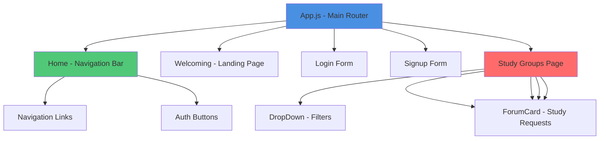
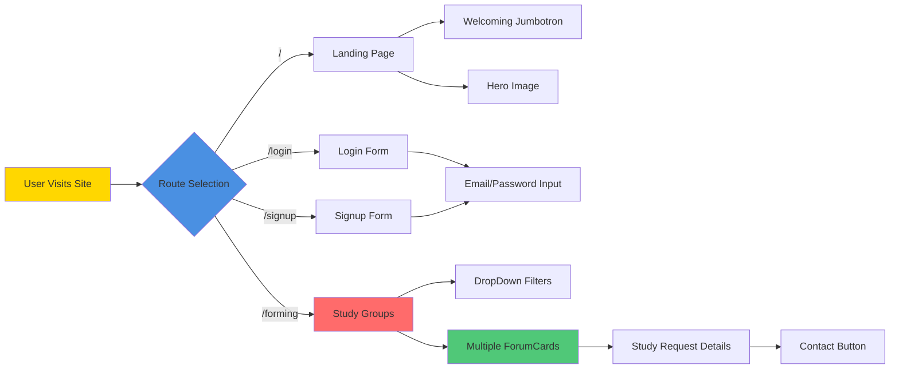

# StudyBuddy

A React-based web platform to help students find study partners and create study groups for their courses. Connect with fellow students, post study requests, and build meaningful academic friendships.

Built in September 2020 as a hackathon project. This application was bootstrapped with [Create React App](https://github.com/facebook/create-react-app) and uses React Bootstrap for a modern, responsive UI.

## Features

- 🔐 User authentication (Login/Signup)
- 🎓 Study group discovery and creation
- 💬 Forum-style study request cards
- 🔍 Dropdown navigation for filtering study groups
- 📱 Responsive Bootstrap UI
- 🌐 Hebrew language support for Israeli students
- 🧭 React Router for seamless navigation

## Application Architecture



## Component Flow



## Getting Started

### Prerequisites

- Node.js (v10 or higher)
- npm or yarn

### Installation

1. Clone the repository:
```bash
git clone https://github.com/orassayag/hackathon-task.git
cd hackathon-task
```

2. Install dependencies:
```bash
npm install
```

3. Start the development server:
```bash
npm start
```

4. Open [http://localhost:3000](http://localhost:3000) in your browser

## Available Scripts

### `npm start`
Runs the app in development mode at [http://localhost:3000](http://localhost:3000).
- Page reloads on edits
- Lint errors appear in console

### `npm test`
Launches the test runner in interactive watch mode.

### `npm run build`
Builds the app for production to the `build/` folder.
- Optimizes React for best performance
- Minifies and hashes filenames
- Ready for deployment

### `npm run eject`
**Warning: This is a one-way operation!**

Exposes webpack configuration for advanced customization.

## Project Structure

```
hackathon-task/
├── public/              # Static files and HTML template
├── src/
│   ├── App.js           # Main component with routing
│   ├── index.js         # Entry point
│   ├── Home.js          # Navigation bar
│   ├── Welcoming.js     # Landing page
│   ├── Login.js         # Login form
│   ├── Signup.js        # Registration form
│   ├── ForumCard.js     # Study group card
│   ├── DropDown.js      # Filter dropdown
│   └── Person.js        # Example component
└── package.json
```

## Technology Stack

- **React 16.13.1** - UI library
- **React Router 5.2.0** - Client-side routing
- **React Bootstrap 1.3.0** - UI components
- **Bootstrap 4.5.2** - Styling framework
- **React Scripts 3.4.3** - Build tooling

## Routes

| Route | Description |
|-------|-------------|
| `/` | Landing page with welcome message |
| `/login` | User login form |
| `/signup` | User registration form |
| `/forming` | Find study buddies and view study requests |

## Components

### Navigation (`Home.js`)
Bootstrap navbar with links to all sections and authentication buttons.

### Landing (`Welcoming.js`)
Hero section with StudyBuddy branding and call-to-action.

### Authentication
- `Login.js` - Email/password login form
- `Signup.js` - User registration form

### Study Features
- `ForumCard.js` - Displays study requests (supports Hebrew)
- `DropDown.js` - Filterable dropdown navigation
- `Person.js` - Example component demonstrating props

## Browser Support

Production build targets:
- >0.2% market share
- Modern browsers (Chrome, Firefox, Safari, Edge)
- Not dead browsers
- Excludes Opera Mini

## Deployment

Build the production version:
```bash
npm run build
```

Deploy the `build/` folder to:
- GitHub Pages
- Netlify
- Vercel
- Heroku
- Any static hosting service

See the [Create React App deployment documentation](https://facebook.github.io/create-react-app/docs/deployment) for detailed instructions.

## Contributing

Contributions are welcome! Please read [CONTRIBUTING.md](CONTRIBUTING.md) for details on our code of conduct and the process for submitting pull requests.

## Learn More

- [Create React App Documentation](https://facebook.github.io/create-react-app/docs/getting-started)
- [React Documentation](https://reactjs.org/)
- [React Bootstrap Documentation](https://react-bootstrap.github.io/)
- [React Router Documentation](https://reactrouter.com/)

## Author

* **Or Assayag** - *Initial work* - [orassayag](https://github.com/orassayag)
* Or Assayag <orassayag@gmail.com>
* GitHub: https://github.com/orassayag
* StackOverflow: https://stackoverflow.com/users/4442606/or-assayag?tab=profile
* LinkedIn: https://linkedin.com/in/orassayag

## License

This project is licensed under the MIT License - see the [LICENSE](LICENSE) file for details.
