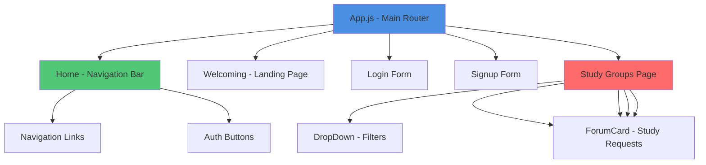
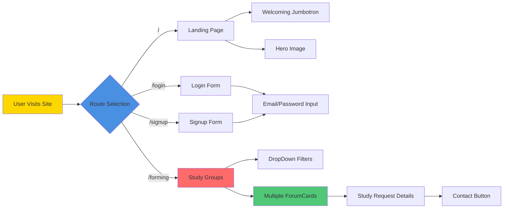

# Hackathon Task

A React-based web platform to help students find study partners and create study groups for their courses. Connect with fellow students, post study requests, and build meaningful academic friendships.

Built in September 2020 as a hackathon project. This application was bootstrapped with [Create React App](https://github.com/facebook/create-react-app) and uses React Bootstrap for a modern, responsive UI.

## Features

### Core Capabilities

- **Student Discovery**: Find study partners for specific courses.
- **Interactive Forums**: Post and view study requests with detailed information.
- **Hebrew Support**: Full support for right-to-left language and Israeli academic context.
- **Secure Access**: Simple login and signup flow for personalized experience.
- **Responsive Interface**: Mobile-friendly design using React Bootstrap.
- 🔐 User authentication (Login/Signup)
- 🎓 Study group discovery and creation
- 💬 Forum-style study request cards
- 🔍 Dropdown navigation for filtering study groups
- 📱 Responsive Bootstrap UI
- 🌐 Hebrew language support for Israeli students
- 🧭 React Router for seamless navigation

### Technical Excellence

- **Modern React**: Built with React 16.13.1 for stable and performant UI.
- **Responsive UI**: Leverages Bootstrap 4.5.2 for consistent styling across devices.
- **Dynamic Routing**: Uses React Router 5.2.0 for a seamless Single Page Application experience.
- **Visual Documentation**: Mermaid-based diagrams for architecture and component flow.
- **Production Optimized**: Efficient build process with minification and hashing.

### Developer Experience

- **Fast Feedback Loop**: Hot reloading during development for instant UI updates.
- **Integrated Tooling**: Pre-configured ESLint and Prettier for code consistency.
- **Easy Bootstrapping**: Standard Create React App structure for familiar development.
- **Comprehensive Docs**: Detailed component and route documentation.

## Application Architecture


```mermaid
graph TD
    A[App.js - Main Router] --> B[Home - Navigation Bar]
    A --> C[Welcoming - Landing Page]
    A --> D[Login Form]
    A --> E[Signup Form]
    A --> F[Study Groups Page]

    B --> G[Navigation Links]
    B --> H[Auth Buttons]

    F --> I[DropDown - Filters]
    F --> J[ForumCard - Study Requests]
    F --> J
    F --> J
    F --> J

    style A fill:#4a90e2
    style B fill:#50c878
    style F fill:#ff6b6b
```

## Component Flow


```mermaid
flowchart LR
    A[User Visits Site] --> B{Route Selection}

    B -->|/| C[Landing Page]
    B -->|/login| D[Login Form]
    B -->|/signup| E[Signup Form]
    B -->|/forming| F[Study Groups]

    C --> G[Welcoming Jumbotron]
    C --> H[Hero Image]

    D --> I[Email/Password Input]
    E --> I

    F --> J[DropDown Filters]
    F --> K[Multiple ForumCards]

    K --> L[Study Request Details]
    L --> M[Contact Button]

    style A fill:#ffd700
    style B fill:#4a90e2
    style F fill:#ff6b6b
    style K fill:#50c878
```

## Getting Started

### Prerequisites

- Node.js (v10 or higher)
- npm or yarn

### Installation

1. Clone the repository:

```bash
git clone https://github.com/orassayag/hackathon-task.git
cd hackathon-task
```

2. Install dependencies:

```bash
npm install
```

3. Start the development server:

```bash
npm start
```

4. Open [http://localhost:3000](http://localhost:3000) in your browser

## Configuration

The application can be configured using environment variables.

```env
PORT=3000 # The port the development server runs on
```

## Usage

1. **Landing Page**: Start at the welcoming page to learn about the platform.
2. **Authentication**: Sign up or log in to access the full features.
3. **Finding Partners**: Navigate to the "Find Study Buddies" section.
4. **Filtering**: Use the dropdown navigation to filter study groups by course or department.
5. **Connecting**: View forum cards and use the contact buttons to reach out to partners.

## Available Scripts

### `npm start`

Runs the app in development mode at [http://localhost:3000](http://localhost:3000).

- Page reloads on edits
- Lint errors appear in console

### `npm test`

Launches the test runner in interactive watch mode.

### `npm run build`

Builds the app for production to the `build/` folder.

- Optimizes React for best performance
- Minifies and hashes filenames
- Ready for deployment

### `npm run eject`

**Warning: This is a one-way operation!**

Exposes webpack configuration for advanced customization.

## Development

### Code Quality

**Format code:**

```bash
npm run format # If configured
```

**Lint code:**

```bash
npm run lint # Included in react-scripts
```

### Architecture Principles

- **Component-Driven**: Built with small, reusable components.
- **Routing-First**: Navigation is handled entirely on the client side.
- **Separation of Concerns**: UI, logic, and routing are clearly separated.
- **State Management**: Uses component-level state for local data handling.

### Design Patterns

- **Composition**: Building complex UIs from simpler components.
- **Unidirectional Data Flow**: Props passed down from parent to child.
- **Controlled Components**: Form inputs managed by React state.
- **Functional Components**: Modern React approach for simpler logic.

### Best Practices

- **Mobile First**: Designed for mobile responsiveness from the ground up.
- **Semantic HTML**: Using correct HTML tags for accessibility.
- **Component Modularization**: Keeping components focused on a single responsibility.
- **Code Consistency**: Following ESLint and Prettier rules.

## Project Structure

```
hackathon-task/
├── public/              # Static files and HTML template
├── src/
│   ├── App.js           # Main component with routing
│   ├── index.js         # Entry point
│   ├── Home.js          # Navigation bar
│   ├── Welcoming.js     # Landing page
│   ├── Login.js         # Login form
│   ├── Signup.js        # Registration form
│   ├── ForumCard.js     # Study group card
│   ├── DropDown.js      # Filter dropdown
│   └── Person.js        # Example component
└── package.json
```

## Directory Structure

```
src/
├── App.js           # Root component and router
├── Home.js          # Navigation and header
├── Welcoming.js     # Landing page
├── Login.js         # User authentication
├── Signup.js        # New user registration
├── ForumCard.js     # Study request display
├── DropDown.js      # Filtering logic
└── index.js         # Application entry point
```

## Technology Stack

- **React 16.13.1** - UI library
- **React Router 5.2.0** - Client-side routing
- **React Bootstrap 1.3.0** - UI components
- **Bootstrap 4.5.2** - Styling framework
- **React Scripts 3.4.3** - Build tooling

## Routes

| Route      | Description                                |
| ---------- | ------------------------------------------ |
| `/`        | Landing page with welcome message          |
| `/login`   | User login form                            |
| `/signup`  | User registration form                     |
| `/forming` | Find study buddies and view study requests |

## Components

### Navigation (`Home.js`)

Bootstrap navbar with links to all sections and authentication buttons.

### Landing (`Welcoming.js`)

Hero section with StudyBuddy branding and call-to-action.

### Authentication

- `Login.js` - Email/password login form
- `Signup.js` - User registration form

### Study Features

- `ForumCard.js` - Displays study requests (supports Hebrew)
- `DropDown.js` - Filterable dropdown navigation
- `Person.js` - Example component demonstrating props

## Browser Support

Production build targets:

- > 0.2% market share
- Modern browsers (Chrome, Firefox, Safari, Edge)
- Not dead browsers
- Excludes Opera Mini

## Deployment

Build the production version:

```bash
npm run build
```

Deploy the `build/` folder to:

- GitHub Pages
- Netlify
- Vercel
- Heroku
- Any static hosting service

See the [Create React App deployment documentation](https://facebook.github.io/create-react-app/docs/deployment) for detailed instructions.

## Contributing

Contributions are welcome! Please read [CONTRIBUTING.md](CONTRIBUTING.md) for details on our code of conduct and the process for submitting pull requests.

## Learn More

- [Create React App Documentation](https://facebook.github.io/create-react-app/docs/getting-started)
- [React Documentation](https://reactjs.org/)
- [React Bootstrap Documentation](https://react-bootstrap.github.io/)
- [React Router Documentation](https://reactrouter.com/)

## Author

- **Or Assayag** - _Initial work_ - [orassayag](https://github.com/orassayag)
- Or Assayag <orassayag@gmail.com>
- GitHub: https://github.com/orassayag
- StackOverflow: https://stackoverflow.com/users/4442606/or-assayag?tab=profile
- LinkedIn: https://linkedin.com/in/orassayag

## License

This application has an MIT license - see the [LICENSE](LICENSE) file for details.

## Acknowledgments

- Built for educational and research purposes
- Respects robots.txt and implements rate limiting
- Uses user-agent rotation to avoid detection
- Implements polite crawling practices
